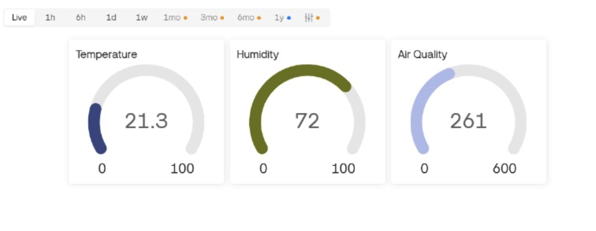

# Air Quality Monitor - IoT Project

[](https://opensource.org/licenses/MIT)

An IoT-based Air Quality Monitoring System using ESP8266 NodeMCU that measures temperature, humidity, and air quality in real-time and displays data on the Blynk mobile app.

## 📋 Table of Contents
- [Problem Statement](#-problem-statement)
- [Features](#-features)
- [Components Required](#-components-required)
- [Circuit Diagram](#-circuit-diagram)
- [Installation](#-installation)
- [Usage](#-usage)
- [Results](#-results)
- [Common Issues & Troubleshooting](#️-common-issues--troubleshooting)
- [Future Scope](#-future-scope)
- [Applications](#-applications)
- [Acknowledgments](#-acknowledgments)

## 🎯 Problem Statement

Indoor air quality affects health, comfort, and productivity. People cannot detect harmful gas levels or humidity/temperature changes. This project provides a low-cost, portable, real-time air monitoring solution.

## ✨ Features

- Real-time monitoring of temperature, humidity, and air quality
- Wi-Fi connectivity for remote access
- Data visualization on Blynk mobile app
- Serial monitor output for debugging
- Low-cost and portable design
- Easy to deploy in homes, schools, or offices

## 🔧 Components Required

| Component | Quantity | Description |
|-----------|----------|-------------|
| ESP8266 NodeMCU | 1 | Wi-Fi microcontroller |
| DHT11 | 1 | Temperature & humidity sensor |
| MQ135 | 1 | Air quality sensor (gases, pollution) |
| Jumper Wires | Several | For connections |
| USB Cable | 1 | For power and programming |
| Breadboard | 1 | Optional for prototyping |

## 📐 Circuit Diagram

### Pin Connections

**DHT11 Sensor:**
- VCC → 3.3V (NodeMCU)
- GND → GND
- DATA → D4 (GPIO2)

**MQ135 Sensor:**
- VCC → 3.3V
- GND → GND
- A0 → A0 (Analog pin)


## 🚀 Installation

> **⚠️ IMPORTANT CAUTION:** It is highly recommended to use a **Windows machine** for uploading code to ESP8266 NodeMCU. macOS users often face driver compatibility issues with CH340/CP2102 USB-to-Serial chips, which can cause upload failures and port detection problems. While workarounds exist for Mac, Windows provides the most stable and hassle-free experience for beginners.

### Prerequisites

1. **Arduino IDE** (Download from [arduino.cc](https://www.arduino.cc/en/software))
2. **ESP8266 Board Package**
3. **Required Libraries:**
   - DHT sensor library
   - Blynk library
   - ESP8266WiFi library

### Step 1: Install Arduino IDE

Download and install Arduino IDE for your operating system.

### Step 2: Add ESP8266 Board to Arduino IDE

1. Open Arduino IDE
2. Go to **File → Preferences**
3. Add this URL to "Additional Board Manager URLs":
```
http://arduino.esp8266.com/stable/package_esp8266com_index.json
```
4. Go to **Tools → Board → Boards Manager**
5. Search for "ESP8266" and install it

### Step 3: Install Required Libraries

1. Go to **Sketch → Include Library → Manage Libraries**
2. Search and install:
   - **DHT sensor library** by Adafruit
   - **Adafruit Unified Sensor**
   - **Blynk** by Volodymyr Shymanskyy

### Step 4: Setup Blynk App

1. Download **Blynk IoT** app (iOS/Android)
2. Create a new account
3. Create a new template/device
4. Add widgets:
   - Gauge widget for Temperature (Virtual Pin V1)
   - Gauge widget for Humidity (Virtual Pin V2)
   - Gauge widget for Air Quality (Virtual Pin V3)
5. Copy your **Auth Token**

### Step 5: Configure the Code

1. Open `code/air_quality_monitor.ino` in Arduino IDE
2. Update these lines with your credentials:
```cpp
char auth[] = "YOUR_BLYNK_AUTH_TOKEN";
char ssid[] = "YOUR_WIFI_SSID";
char pass[] = "YOUR_WIFI_PASSWORD";
```

3. Select **Board**: NodeMCU 1.0 (ESP-12E Module)
4. Select correct **Port**
5. Click **Upload**

## 💻 Usage

1. Connect the ESP8266 to your computer via USB
2. Upload the code
3. Open **Serial Monitor** (115200 baud rate)
4. Device will connect to Wi-Fi and Blynk
5. Open Blynk app to view real-time data
6. Monitor air quality, temperature, and humidity

## 📊 Results

### Serial Monitor Output
- Real-time sensor readings
- Wi-Fi connection status
- Blynk connection status

### Blynk Dashboard
- Temperature display
- Humidity percentage
- Air Quality Index (AQI)



## ⚠️ Common Issues & Troubleshooting

### 1. **ESP8266 Not Connecting to Wi-Fi**

**Problem:** Device fails to connect to Wi-Fi network, shows "Connecting..." indefinitely.

**Solutions:**
- Verify your Wi-Fi SSID and password are correct (case-sensitive)
- ESP8266 only supports 2.4GHz Wi-Fi networks, not 5GHz
- Check if your router has MAC filtering enabled
- Try moving the device closer to the router
- Ensure your Wi-Fi network doesn't have special characters in the password
- Check if your network requires additional authentication (captive portal)

```cpp
// Add this to debug Wi-Fi connection:
Serial.println(WiFi.status());
```

### 2. **Blynk Connection Failed**

**Problem:** "Blynk connection timeout" or "[ERROR] Connection failed" in Serial Monitor.

**Solutions:**
- Double-check your Auth Token is correct
- Ensure you're using the correct Blynk server region
- Verify your Blynk device/template is active
- Check if you've exceeded the free plan limits
- Try using `blynk.cloud` instead of legacy Blynk server
- Make sure the device is connected to Wi-Fi first

### 3. **DHT11 Sensor Reading Errors**

**Problem:** Shows "nan" (not a number), "Failed to read from DHT sensor", or wildly incorrect readings.

**Solutions:**
- Check all connections, especially the DATA pin to D4
- Add a 10kΩ pull-up resistor between DATA and VCC pins
- Verify the sensor is getting 3.3V power
- Increase the delay between readings (DHT11 needs 2+ seconds)
- The sensor might be faulty - try another one
- Ensure you're using the correct DHT type in code: `DHT dht(DHTPIN, DHT11);`

### 4. **MQ135 Sensor Always Shows Same Value**

**Problem:** Air quality reading doesn't change or shows constant value around 1023 or 0.

**Solutions:**
- MQ135 requires 24-48 hours of preheating for accurate readings
- Check if the sensor is getting proper power (needs 5V for best performance)
- Verify the A0 pin connection
- The sensor needs calibration in clean air first
- Try reading raw analog values to debug: `analogRead(A0)`
- Some MQ135 modules need DO (digital output) instead of AO

### 5. **Upload Failed / Port Not Detected**

**Problem:** "Failed to connect to ESP8266" or COM port not showing in Arduino IDE.

**Solutions:**
- **Windows:** Install CP2102 or CH340 USB drivers (depending on your NodeMCU version)
- **macOS Users (Common Issue):** Mac often has severe driver compatibility problems with CH340/CP2102 chips
  - Download and install the latest CH340 drivers from the manufacturer
  - May need to disable System Integrity Protection (SIP) temporarily
  - Check System Preferences → Security & Privacy for blocked drivers
  - Try `ls /dev/cu.*` in Terminal to see if device is detected
  - **Recommendation:** Use a Windows machine or Linux VM to avoid these issues
- Try a different USB cable (some are power-only)
- Press and hold the FLASH button while uploading
- Check Device Manager (Windows) or Terminal (Mac) to see if the device is detected
- Try a different USB port
- Reduce upload speed to 115200 in Arduino IDE

### 6. **Code Compilation Errors**

**Problem:** Errors like "ESP8266WiFi.h: No such file or directory" or library not found.

**Solutions:**
- Ensure ESP8266 board package is properly installed
- Install all required libraries via Library Manager
- Select the correct board: "NodeMCU 1.0 (ESP-12E Module)"
- Check library compatibility with your Arduino IDE version
- Restart Arduino IDE after installing libraries
- Clear Arduino cache: Delete contents of `%TEMP%/arduino_build_*` folders

### 7. **High Power Consumption / Overheating**

**Problem:** ESP8266 or sensors getting very hot, frequent disconnections.

**Solutions:**
- Don't power both sensors and ESP8266 from 3.3V pin simultaneously
- Use external 5V power supply for sensors if possible
- Add heat sinks to the voltage regulator on NodeMCU
- Reduce Wi-Fi transmission power in code if not needed
- Add delays between sensor readings to reduce power draw
- Use deep sleep mode when not actively monitoring

### 8. **Inaccurate or Fluctuating Readings**

**Problem:** Sensor values jump around wildly or don't match reality.

**Solutions:**
- Implement a moving average filter for stable readings
- Add capacitors (100µF) across sensor power pins to reduce noise
- Keep sensors away from heat sources (including ESP8266)
- Calibrate sensors in known conditions
- Use shielded wires for sensor connections if possible
- Add delays between readings: DHT11 needs 2+ seconds, MQ135 needs 1+ second

```cpp
// Example: Moving average for stable readings
float readings[10];
int readIndex = 0;
float total = 0;
float average = 0;

void loop() {
  total = total - readings[readIndex];
  readings[readIndex] = analogRead(A0);
  total = total + readings[readIndex];
  readIndex = (readIndex + 1) % 10;
  average = total / 10;
}
```

### 9. **Blynk App Not Updating in Real-Time**

**Problem:** Data appears in Serial Monitor but not in Blynk app, or updates very slowly.

**Solutions:**
- Check if `Blynk.run();` is called in the `loop()` function
- Ensure you're not using `delay()` excessively (blocks Blynk communication)
- Verify virtual pin assignments match in code and app
- Check if your Blynk plan allows real-time updates
- Use `BlynkTimer` instead of `delay()` for better performance
- Force app refresh by pulling down on the screen

### 10. **Memory Issues / Random Crashes**

**Problem:** ESP8266 resets randomly, "Out of memory" errors, or unstable operation.

**Solutions:**
- ESP8266 has limited RAM (~80KB usable) - optimize your code
- Reduce string usage, use F() macro for Serial.print statements
- Don't store large arrays or buffers
- Use PROGMEM for constant data
- Monitor free heap: `Serial.println(ESP.getFreeHeap());`
- Reduce Blynk virtual pin updates frequency

### 11. **Sensor Placement Issues**

**Problem:** Readings don't seem to reflect actual room conditions.

**Best Practices:**
- Don't place sensors near windows, doors, or air vents
- Keep away from direct sunlight or heat sources
- Mount at breathing height (4-6 feet) for accurate room air quality
- Allow air circulation around sensors
- Keep MQ135 away from moisture and DHT11
- Don't enclose sensors in tight boxes without ventilation

### 12. **Time Synchronization Issues**

**Problem:** Timestamps are incorrect or data logging shows wrong times.

**Solutions:**
- Add NTP (Network Time Protocol) client to sync time
- Use RTC (Real-Time Clock) module for offline timekeeping
- Set timezone in your code
- Check if Blynk's server time widget is configured correctly

```cpp
// Add NTP time sync:
#include <time.h>
configTime(19800, 0, "pool.ntp.org", "time.nist.gov"); // GMT+5:30 for India
```

## 💡 Tips for Success

- **Test components individually** before integrating everything
- **Use Serial Monitor extensively** for debugging (115200 baud rate)
- **Keep firmware and libraries updated** for bug fixes
- **Document your modifications** if you change the circuit
- **Start with basic examples** for each sensor before combining
- **Use a good quality power supply** - many issues stem from inadequate power
- **Join IoT communities** (Arduino forums, Reddit r/esp8266) for help

## 🔮 Future Scope

- [ ] Add CO₂ sensor for better accuracy
- [ ] Add PM2.5 sensor for particulate matter detection
- [ ] Implement alarm/notifications for poor air quality
- [ ] Add battery power for portability
- [ ] Create dedicated mobile app
- [ ] Add data logging to SD card
- [ ] Implement machine learning for air quality prediction

## 🎓 Applications

- Home air quality monitoring
- Smart home automation
- School/office environment monitoring
- Indoor pollution detection
- Health and wellness tracking

## 🙏 Acknowledgments

- OpenWeather API for weather data references
- Blynk IoT platform for mobile app integration
- Arduino community for libraries and support

---

## 📌 Additional Information

### ESP8266 NodeMCU Pin Connections

**DHT11 Sensor:**
- VCC → 3.3V
- GND → GND  
- DATA → D4 (GPIO2)

**MQ135 Sensor:**
- VCC → 3.3V (or 5V if available)
- GND → GND
- A0 → A0 (Analog Input)

**Power:**
- USB Cable to NodeMCU for power and programming

**Blynk Virtual Pins:**
- V1 → Temperature
- V2 → Humidity
- V3 → Air Quality Index

### Required Arduino Libraries

1. ESP8266WiFi (Built-in with ESP8266 board package)
2. BlynkSimpleEsp8266 (Install via Library Manager)
3. DHT sensor library by Adafruit (v1.4.x or higher)
4. Adafruit Unified Sensor (v1.1.x or higher)

**Installation Instructions:**
1. Open Arduino IDE
2. Go to Sketch → Include Library → Manage Libraries
3. Search for each library by name
4. Click "Install"
